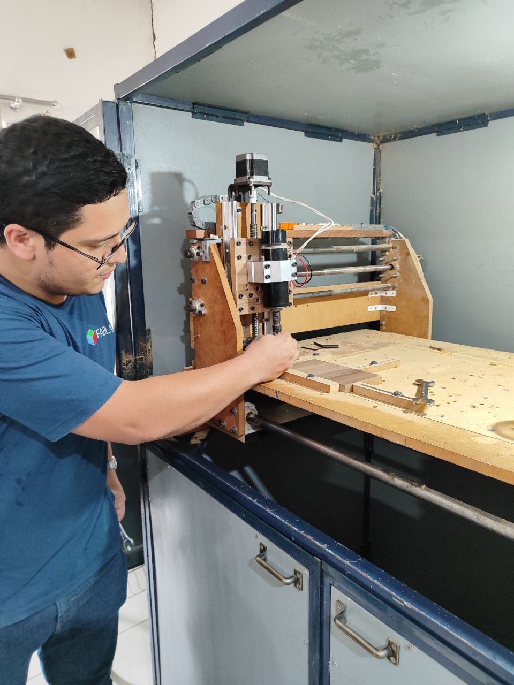
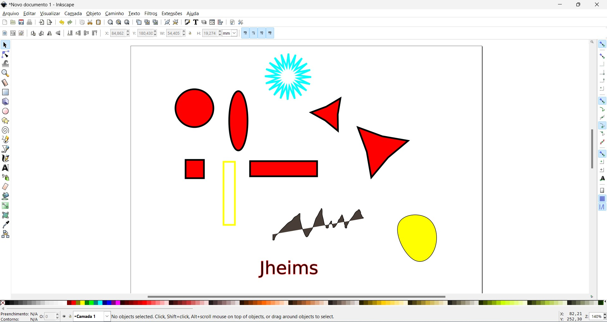
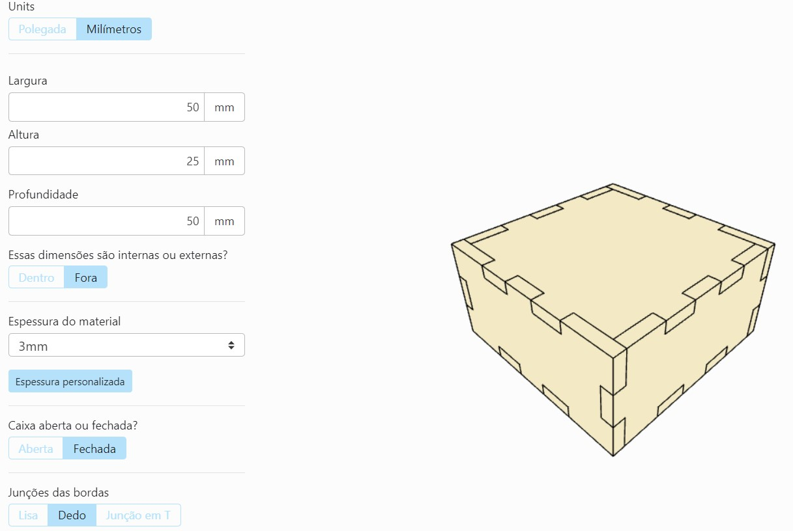
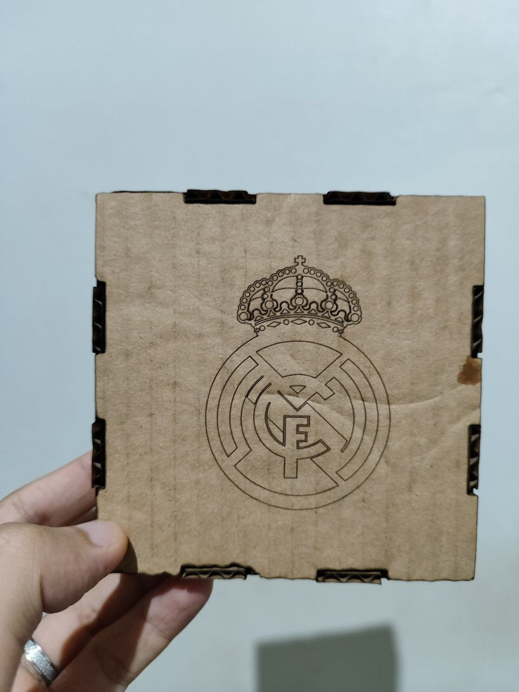
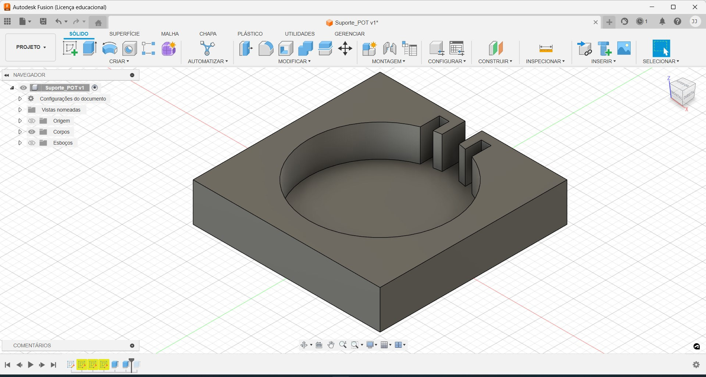
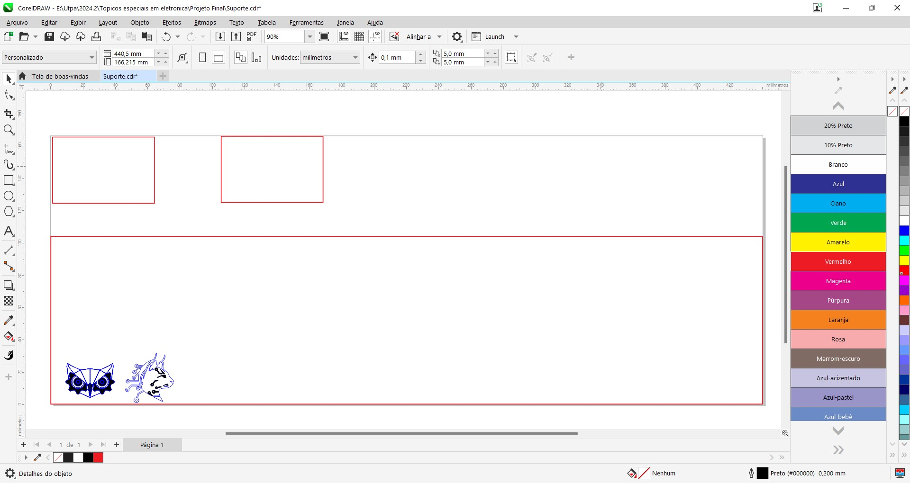
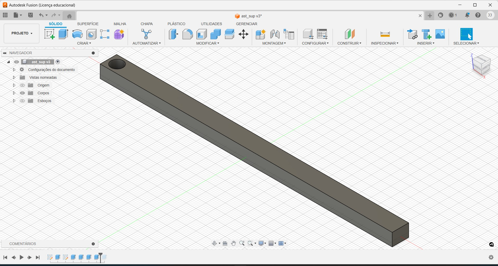
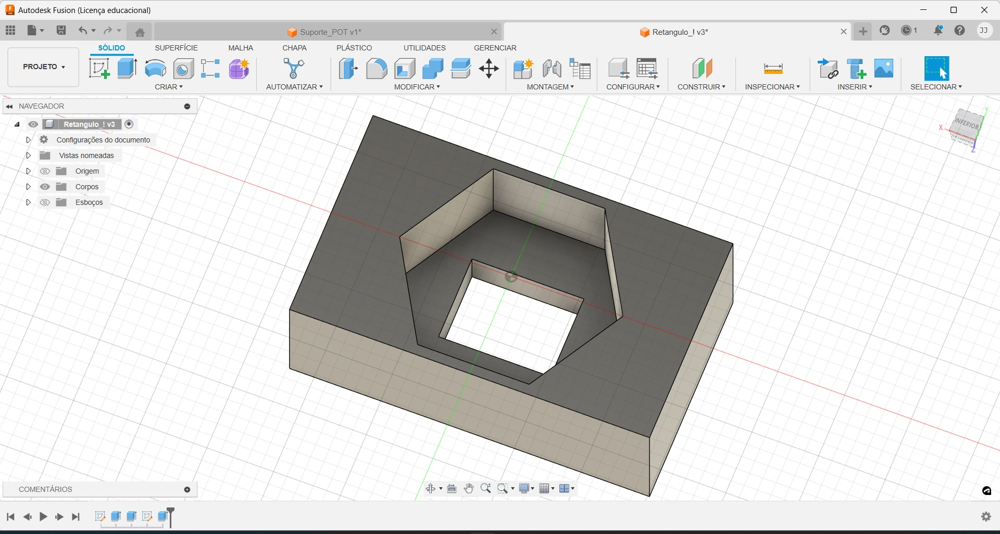

# Introdução

Usando tecnologias avançadas como máquinas CNC, impressoras 3D, corte a laser e circuitos impressos, conseguimos fazer peças complexas com uma alta precisão e de um jeito muito mais eficiente e simples. Este relatório visa dar uma visão geral sobre a disciplina Fabricação digital, mostrando a teoria e a prática sobre como são feitas as peças, desde seu desenho a operação das máquinas.

# Máquinas CNC

## Origens

As máquinas CNC (Controle Numérico Computadorizado) começaram a aparecer quando a indústria queria automatizar a usinagem para deixar tudo mais preciso e eficiente, onde começou na década de 1940 e 1950. Desde então as máquinas CNC evoluíram muito, passando de simples perfuradoras a equipamentos altamente sofisticados que são fundamentais na fabricação digital de hoje, e algumas dessas máquinas deixaram de ser apenas de indústrias e passaram a ser mais acessíveis para as pessoas em geral, tendo um custo bem menor que antes.

<figure style="text-align: center;">
  
  <figcaption style="text-align: center;">Figura 1: Maquina CNC do laboratório. </figcaption>
</figure>

## Terminologias

Quando falamos de máquinas CNC, precisamos entender de termos específicos que a como por exemplo, o G-code é a "linguagem" que a máquina entende para saber o que fazer. O CAD (Computer-Aided Design) é o software que usamos para desenhar as peças, e o CAM (Computer-Aided Manufacturing) é o software que converte esses desenhos em comandos que a máquina consegue entender. E os eixos XYZ são basicamente os diferentes movimentos que a máquina pode fazer para esculpir o material. Esses termos são essenciais para entender como as máquinas CNC funcionam e como os comandos são dados e executados.

## Configurações de máquina

As máquinas CNC podem ser configuradas de diferentes maneiras, dependendo do que precisamos usinar, por exemplo, precisamos escolher o material certo para a peça que estamos fazendo, as ferramentas de corte apropriadas, a velocidade de operação (podemos exemplificar a máquina de corte a laser, onde precisamos definir a potência dela para cortar um material ou mesmo para gravar na superfície do mesmo), entre outros parâmetros pois tudo isso afeta diretamente a qualidade e a precisão das peças produzidas. 

## Segurança

Segurança é super importante quando estamos lidando com máquinas CNC, porque com muita potência. É essencial ter proteções físicas para os operadores, sistemas de parada de emergência e treinamento adequado para garantir que todo mundo saiba o que está fazendo e possa trabalhar de maneira segura. O laboratório também conta com um extintor e pessoas que podem ajudar a resolver caso alguma máquina possa apresentar mal funcionamento, tudo isso a fim de evitar acidentes.

## Fluxo de trabalho

O fluxo de trabalho numa máquina CNC começa com a criação do projeto no software CAD, onde desenhamos o que queremos fabricar, após isso, esse projeto é transformado em um formato que o software que será usado pela máquina entende. carregando esse código na máquina CNC e ela começa a usinar o material conforme o projeto e dependendo da máquina, pois essas máquinas funcionam com materiais específicos e que as vezes não se pode substituir ele.

# Desenho 2D

Começando pelo mais simples, precisaremos entender sobre algumas técnicas de desenho. O software apresentado na aula foi o Inkscape, que é usado para criar desenhos 2D e possui algumas ferramentas bastante conhecidas e interessantes, entre as mais usadas estão a ferramenta de Seleção para mover e redimensionar objetos, a de Desenho de Caminhos para criar formas livres e curvas Bézier, e as ferramentas de Retângulo e Elipse para desenhar formas geométricas básicas. O Inkscape também possui ferramentas de Texto para adicionar e estilizar texto, a Caneta Caligráfica para linhas com aparência de pincelada, e as opções de Preenchimento e Borda para ajustar cores e gradientes.

<figure style="text-align: center;">
  
  <figcaption style="text-align: center;">Figura 2: desenho Inkscape. </figcaption>
</figure>

# Corte a laser

  

## Teoria

O corte a laser é uma técnica de fabricação digital que utiliza feixes de laser concentrados para cortar materiais com precisão. O corte a laser envolve princípios de óptica e controle de feixes, onde a potência do laser e a velocidade de movimento influenciam diretamente na qualidade e na eficiência do corte. A potencia é controlado diretamente pela máquina, podemos muda-la para cortar determinado material, como os mais usados no laboratório são mdf, acrílico e papelão, onde possui uma tabela na parede sobre a potência usada para esses materiais na espessura de 2mm. Também nessa mesma máquina é possível fazer gravações. Essa máquina utiliza imagens vetoriais no formato SVG, para corte o desenho precisa ser contornado em vermelho RGB, para gravar é utilizado a cor preta RGB e com potencia menor que a do corte. A velocidade da máquina é controlada pelo usuário no software K40Whisperer.

## Prática

Para utilizar a máquina de corte a laser, o professor nos pediu para acessar o site makerCase, que desenha caixas apenas dando as dimensões e ele nos entrega o formato svg ou DXF caso queiramos editar as imagens, fiz uma caixa por esse site e procurei um símbolo na internet do time europeu Real Madrid, e utilizando o software Inkscape para fazer o contorno do desenho utilizando a ferramenta bitmap e assim poder gravar no papelão, que é o material que escolhi para cortar.

<figure style="text-align: center;">
  
  <figcaption style="text-align: center;">Figura 3: Desenho da caixa no makercase. </figcaption>
</figure>

Após o desenho, ela foi personalizada e o resultado final foi esse:

<figure style="text-align: center;">
  
  <figcaption style="text-align: center;">Figura 4: Caixa finalizada. </figcaption>
</figure>

# Desenho 3D

## Teoria

Desenho 3D envolve a criação de imagens tridimensionais de objetos com o uso de softwares de modelagem digital e diferentemente do desenho 2D, que representa apenas largura e altura, o desenho 3D também inclui a profundidade, proporcionando uma visualização mais realista e detalhada dos objetos. Para desenvolver projetos mais complexos, precisaremos utilizar a impressora 3D para dar vida as nossas criações. Para iniciar, temos que desenhar antes, um dos softwares que usamos foi o Fusion 360, que podemos fazer diversas coisas, várias formas onde suas principais funcionalidades incluem modelagem 3D paramétrica e direta, criação de superfícies, montagem de componentes, simulação e análise estrutural, começando pelo esboço e em seguida criando o modelo por esse esboço.

<figure style="text-align: center;">
  
  <figcaption style="text-align: center;">Figura 5: Impressora 3D laboratório. </figcaption>
</figure>

## Prática

Para a nossa prática, o professor indicou o site Thingiverse para pegar um desenho pronto e imprimir na impressora 3D. Como eu iria fazer o projeto final e precisaria imprimir umas pesas, aproveitei e desenhei essa peça para imprimir. Não consegui imprimir no mesmo dia por conta da disponibilidade de cartão de memória para as impressoras, então deixei para imprimir no outro dia, aproveitei a aula para fazer a modelagem da minha peça em 3D.

<figure style="text-align: center;">
  
  <figcaption style="text-align: center;">Figura 6: Desenho 3D no Fusion 360. </figcaption>
</figure>

# Plotter

  

Para a apresentação dessa máquina, eu não pude chegar a tempo na aula para saber sobre a teoria da mesma, porém conversando com alguns colegas e pesquisando um pouco, a plotter é uma máquina que utiliza o mecanismo CNC para desenhar, esses desenhos podem ser a caneta ou cortados diretamente com  cortadores e essa máquina possui uma alta precisão, pois também é muito utilizada em gráficas pela sua facilidade e detalhes que ela possui na hora de desenhar, seja em papel, tecidos e outros materiais.

Ela funciona utilizando dois eixos, x e y para dar vida aos desenhos 2D que foram desenhados antes. O desenho que escolheram no dia da aula foi um pouco complexo e a máquina apresentou um mal funcionamento por conta de alguns problemas na hora de manusear, porém com a ajuda de algumas pessoas no laboratório, o problema foi resolvido. Nos aconselharam a começar por um desenho mais simples para entender como funciona a máquina e a como resolver os problemas que apareceriam pelo caminho.

# Placa de circuito

## Processo de corrosão e manipulação do ácido

Aprender a cria circuitos impressos é um grande avanço para engenheiros eletricistas, pois pode dar vida a projetos que antes seriam feitos em uma protoboard utilizando diversos jumpers, isso prejudica quando queremos projetos mais complexos e com um acabamento melhor, pois pode dar uma má conexão e desconectar determinada parte do circuito e comprometendo seu funcionamento. Para isso, nos foi apresentado o método de criar placas de circuitos, e um dos métodos para desenhar a trilha é o processo de corrosão. 

Antes de começar o processo de corrosão, nos foi advertido a utilizar luvas, caça e sapato fechado para poder manipular a mistura química, pois em contato com a pele pode machucar e causar algum irritamento, e também nos é dito para não levar as mãos aos olhos e boca.
Para começar, precisaremos antes desenhar o nosso circuito e para isso podemos usar alguns softwares ou em sites. O que eu já tinha mais familiaridade é o Proteus, após nos mostrarem como fazer o circuito e mostrar o seu desenho 2D das trilhas, utilizaram a máquina de corte a laser para cortar os caminhos das trilhas e remover o adesivo para começar o processo de corrosão. Após isso nos foi mostrado a maneira como é feito o método de corrosão, onde adicionam uma mistura química que remove o cobre em um determinado tempo. Algumas técnicas para acelerar o processo consiste em ficar balançando o pote com a mistura e a placa de cobre até notarmos que foi completamente corroído. 

## Soldagem
Após a criação da placa, nos ensinaram a como começar a soldagem e algumas dicas de como fazer. Precisamos deixar o ferro esquentar bastante e tomar cuidado com a temperatura que estamos usando, para não danificar algum componente ou a trilha de cobre que criamos com o processo de corrosão. Temos que observar sempre se o ferro de solda está limpo e também podemos usar uma pasta especial que serve para fixar mais a solda. Sempre nos atentando e tomando cuidado na hora de manipular essas ferramentas e observar se os componentes estão na polaridade correta, como capacitores polarizados, diodos, entre outros.

# Arduíno

  

## Introdução
Os microcontroladores tornaram-se bastante famosos nos laboratórios, pois é uma ferramenta bastante poderosa, pois nos permite controlar circuitos simples e complexos apenas com a programação. Como exemplo de um projeto simples, temos um led, resistor e Arduino, para controlarmos o led, podemos utilizar essa placa de microcontrolador, podemos decidir se ele vai ficar aceso, desligada, se vai ficar piscando, se vai ficar ligada por um determinado tempo e depois desligar. Tudo isso com o mesmo circuito, apenas mudando a programação, por isso ele se tornou tão popular, pela sua facilidade e alta gama de processos que podemos fazer utilizando essa placa.

## Bancada motor gerador

  

Para um processo um pouco mais complexo utilizando o Arduino, podemos observar a bancada motor gerador que é utilizada no laboratório de controle. Uma bancada que parece simples pois possui dois motores, um capacitor e resistor que funcionam como filtro passa baixa, uma ponte h e o arduíno. Onde um motor funciona como gerador e outro como motor, o gerador funciona no nosso circuito como um sensor para coletar dados e armazena-los. Utilizamos também o python para ler, armazenar e trabalhar em cima desses dados, por exemplo, plotar o gráfico, criar um controlador P, PI, entre outros e implementá-los na bancada posteriormente.

# Projeto Final
\

  

## Ideia

Como sugestão do professor, optamos por criar um pêndulo invertido utilizando o carrinho de uma impressora que estava inutilizável. Para isso, tivemos que desmontar e testar seus motores dc e o seu sensor, para saber se é possível seguir com esse projeto. Utilizamos um resistor multivolta de 10kΩ, uma fonte de alimentação dc de 8V e o Arduino uno juntamente com uma ponte H.

## Design
Para iniciar o nosso projeto, primeiramente precisamos criar alguns desenhos e modelos, nós vamos utilizar tanto a máquina de corte a laser quanto a impressora 3D para fabricar nossas peças com precisão.

Começamos cortando a base do nosso projeto. Utilizamos uma madeira firme e resistente para garantir durabilidade e um acabamento estético mais agradável. Em seguida, utilizamos a máquina de corte a laser para gravar nossas logos na superfície da madeira, pois o laser permite uma gravação precisa e detalhada, o que resulta em um acabamento melhor e personalizável que destaca a identidade do nosso projeto.

<figure style="text-align: center;">
  
  <figcaption style="text-align: center;">Figura 7: Base com as gravações no laser. </figcaption>
</figure>

Com a impressora 3D, partimos para a criação de componentes mais complexos. Utilizamos o software Fusion 360 para desenhar a haste e a ponta dela, pois este software oferece ferramentas avançadas de modelagem 3D que nos permitem criar designs detalhados e personalizados. A ponta da haste foi projetada especificamente para encaixar uma porca de parafuso. Esta solução foi pensada para permitir que um peso seja acoplado à ponta da haste, adicionando a estabilidade necessária para o funcionamento adequado do nosso pêndulo.

\

<figure style="text-align: center;">
  
  <figcaption style="text-align: center;">Figura 8: Aste do pendulo. </figcaption>
</figure>

\

<figure style="text-align: center;">
  
  <figcaption style="text-align: center;">Figura 9: ponta do pendulo para colocar o peso. </figcaption>
</figure>

Além disso, para organizar e proteger os componentes eletrônicos, como o Arduino e a ponte H, precisávamos de uma caixa personalizada. Utilizamos o site makerCase para desenhar uma caixa que atendesse às nossas necessidades específicas. Este site é uma ferramenta prática que nos permite criar modelos de caixas ajustáveis, facilitando o processo de design inicial. Depois de criar o modelo básico no makerCase, importamos o desenho para o software CorelDraw e nele, realizamos modificações adicionais, como a inclusão de gravuras decorativas e o corte preciso dos encaixes para o Arduino e demais componentes. Esta etapa é importante para garantir que todos os elementos se encaixem perfeitamente e fiquem bem organizados dentro da caixa, protegendo os circuitos e conexões de possíveis danos.

\

<figure style="text-align: center;">
  
  <figcaption style="text-align: center;">Figura 10: ponta do pendulo para colocar o peso. </figcaption>
</figure>